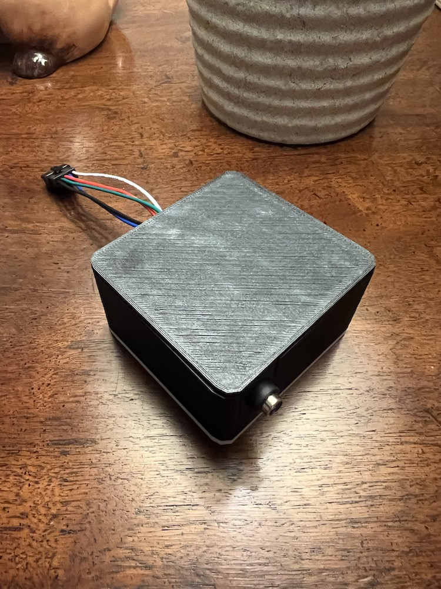
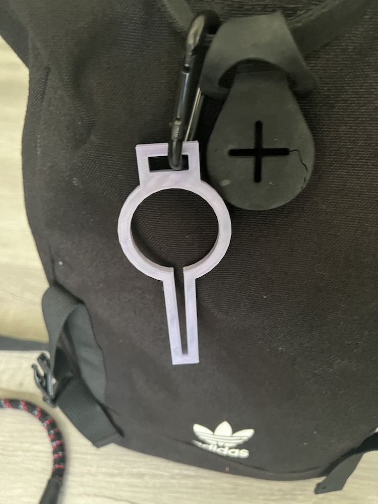

# Printables

Some very elementary OpenSCAD models.

## ESP32 Breakout Case

 - ESP32 30 pin: https://www.aliexpress.us/item/3256804992462822.html
 - Breakout Board: https://www.amazon.com/dp/B0BQ2N4MSZ
 - Standoffs: https://www.amazon.com/dp/B08F1W3ZXW
 - Hardware: https://www.amazon.com/dp/B012TF5F30

## Pooped Bag Holder

